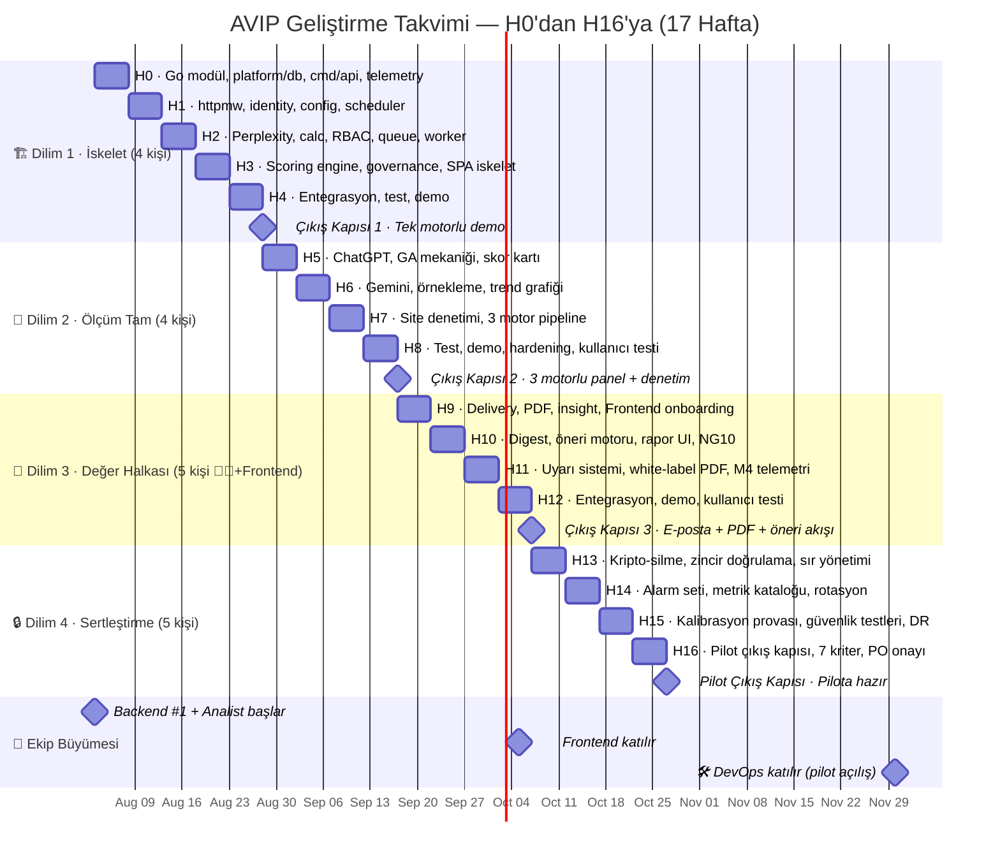

# 0401 · Development Process

| Alan | Değer |
|---|---|
| Doküman ID | 0401 |
| Proje | AI Visibility Intelligence Platform (kod adı: AVIP) |
| Versiyon | 1.10 |
| Durum | Review |
| Sahip | U2 AI Studio · Engineering |
| Tarih | 22 Temmuz 2026 |
| Karşıladığı madde | 25 · Development Process (git akışı, branching, code review, DoD) |
| İlişkili | 0305, 0306, 0303, 0007, 0205 (girdi); 0403, 0404, 0406 (çıktı) |

---

## 1. Amaç ve Kapsam

Bu doküman geliştirme sürecinin işleyiş sözleşmesini sabitler: dallanma modeli, iş kalemi yaşam döngüsü, gözden geçirme disiplini, bitmişlik tanımı, doküman-kod senkronu ve uygulama dilim planı. Faz 4'ün açılış dokümanıdır; süreç kuralları burada, teknik zorlamaları 0403'te (CI kapıları), test ayrıntısı 0404'te yaşar. Kapsam dışı: kadro ve rol atamaları (set genel kuralı), iş takip aracının seçimi (O-1), sürüm numaralandırma ve yayın treni (0406).

## 2. Akış Modeli ve Dallanma

Model trunk-based'dir: main her an dağıtılabilir durumdadır; iş kısa ömürlü dallarda yapılır ve küçük PR'larla main'e döner. Uzun süren işler bayrak arkasında parça parça birleşir (feature flag; yarım özellik main'de kapalı bayrağıyla yaşayabilir, yarım dal haftalarca açık kalamaz). Dal adlandırma iş kalemi kimliğiyle başlar; dallar birleşince silinir. Yayın dalı yoktur; sürüm etiketleme ve yayın treni 0406'da tanımlanır. Acil düzeltme aynı akıştan gider: hotfix dalı → hızlandırılmış gözden geçirme (§4 istisnası) → main → yayın.

## 3. İş Kalemi Yaşam Döngüsü

İş kalemleri doküman setinden türetilir ve izlenebilirlik kimliği taşır: her kalem ilgili FR/NFR, UC, değişmez (I) veya doküman bölümüne bağlanır; kaynağı olmayan iş kalemi açılmaz (kapsam sızmasının süreç freni). Durum akışı beş adımdır: hazır → geliştirmede → gözden geçirmede → doğrulamada → bitti; doğrulama adımı DoD kontrolüdür (§5). Tahminleme hafiftir (küçük/orta/büyük); büyük kalem bölünmeden geliştirmeye giremez. Devam eden iş sınırlıdır: kişi başına aynı anda tek geliştirmede kalem normu; tıkanıklıkta yeni iş açmak yerine gözden geçirme ve doğrulama kuyruğu eritilir.

## 4. Kod Gözden Geçirme ve PR Disiplini

Her değişiklik PR ile gelir; kendi kendine birleştirme yasaktır ve en az bir onay gerekir; CODEOWNERS yönlendirmesi bağlam sahibini işaretler (0305 §8). PR küçüklüğü normdur: tek amaç, tek kalem; büyük PR gözden geçirilemez ve bölünmesi istenir. PR şablonu dört alanı zorunlu kılar: amaç ve kapsam, izlenebilirlik kimlikleri, test kanıtı (koşulan paketler), etki etiketi (migration, sözleşme, güvenlik, telemetri). Migration ve sözleşme etiketli PR'lar ilgili kural setine referans verir (0303 §6, 0306 §2) ve 0403 kapılarından geçmeden birleşemez. Hotfix istisnası: tek onay + sonradan tam gözden geçirme kaydı; istisnanın sınırları O-4'te netleştirilir. Gözden geçirme üslubu yazılıdır ve gerekçelidir; onay, DoD sorumluluğunu paylaşmaktır.

## 5. Definition of Done

| # | Kriter |
|---|---|
| 1 | Kod tamam ve tüm testler yeşil; hesap motoru veya izolasyon yüzeyine dokunan değişikliklerde ilgili birim ve negatif test paketleri zorunlu koşulur (0404). |
| 2 | Lint, biçim ve import kuralları temiz (0305 D1-D7; depguard). |
| 3 | Sözleşme ve şema drift kontrolleri geçti (OpenAPI senkronu, migration baştan uygulanabilirliği). |
| 4 | Dokümantasyon etkisi işlendi: tasarım sözleşmesi değiştiyse ilgili dokümana changelog notu veya v1.1 kuyruğuna kayıt (§6). |
| 5 | Gözlemlenebilirlik eklendi: yeni uç veya iş sınıfı metrik ve log sözleşmesiyle geldi (0311 kataloğu güncel). |
| 6 | Güvenlik maddeleri işaretli: girdi doğrulama, yetki denetimi, sır hijyeni (0310 §9 sürekli halka). |
| 7 | Feature flag durumu net: bayrak adı, varsayılan durumu ve kaldırma koşulu kayıtlı. |
| 8 | Denetim izi etkisi değerlendirildi: ayrıcalıklı yeni eylem varsa audit yazımı eklendi (N6). |

## 6. Doküman-Kod Senkronu

Bu doküman seti canlı sözleşmedir; kod onu sessizce eskitemez. Kural: bir değişiklik herhangi bir dokümandaki tasarım sözleşmesini değiştiriyorsa, PR ya ilgili dokümanın changelog güncellemesini içerir ya da v1.1 kuyruğuna kayıt düşer; hangisi olacağına değişiklik tipi karar verir. Tip 1 değişiklik PO onayı ister ve 0007 karar defterine işlenir; Tip 2 changelog + haftalık özetle yürür (0007 süreci). Yeni mimari karar ADR olarak docs/adr altına yazılır ve 0304 changelog'una bağlanır. Drift iki yerde yakalanır: teknik kapılar (0403: OpenAPI, şema, tip senkronu) ve dönemsel doküman gözden geçirme kadansı (O-3); gözden geçirmede kod-doküman farkları listelenir ve kapatılır.

## 7. Walking Skeleton ve Dilim Planı

| Dilim | Kapsam | Çıkış kanıtı |
|---|---|---|
| 1 · İskelet | platform (db, httpmw, telemetry) + identity (kayıt/oturum) + config (marka + panel asgari) + measure (tek bağdaştırıcı) + governance (denetim yazıcısı, kota iskeleti); uçtan uca: tek prompt ölçümü → calculation_run → etiketli skor | Canlı ortamda uçtan uca demo; korelasyon zinciri logda izlenir |
| 2 · Ölçüm tam | Kalan iki bağdaştırıcı, örnekleme ve GA tam (0309), pano temel görünümleri, site denetimi (UC-04) | Üç motorlu panel skoru + saniyeler içinde denetim bulgusu |
| 3 · Değer halkası | delivery (uyarı, digest, haftalık özet, rapor) + insight (kural tabanlı öneri + NG10) | Derin bağlantılı e-posta özeti + PDF rapor + öneri akışı |
| 4 · Sertleştirme | 0310 paketlerinin tamamı (zincir, kripto-silme altyapısı, rotasyon), 0311 alarm seti, kalibrasyon provası | Pilot çıkış kapısı ön kontrol listesi (0205 §8) yeşil |

Dilim 1 bağdaştırıcı seçimi O-2 kararıdır (öneri: Perplexity; direct kademe ve en yalın alıntı modeli iskelet riskini düşürür). Her dilim kapanışı demo + doküman senkron kontrolü içerir; dilim atlanarak ilerlenmez.

### 7.1 Dilim 1 Haftalık Plan (4 kişi: Siz TL+CEO, Backend #1, Backend #2, Analist)

Dilim 1, haftalık yinelemelerle 4 haftada tamamlanır. Her hafta sonunda bir çıktı (milestone) üretilir. Bağımlılık zinciri: platform/db → platform/httpmw → identity → config → measure → governance. Analist (AN) paralel ilerler.

| Hafta | Siz (TL+CEO) | Backend #1 (Platform) | Backend #2 (Geniş) | Analist (AN) | Hafta Çıktısı |
|---|---|---|---|---|---|
| **H0** | Go modül iskeleti; measure arayüzü + engines kayıt defteri tasarımı | platform/db: PostgreSQL havuz + sqlc kurulumu; ilk migration (kiracı, kullanıcı); Docker Compose (PG, Redis, S3) | cmd/api iskeleti; platform/telemetry: OTel kurulumu; Makefile + golangci-lint yapılandırması | Tüm doküman setini okuma; ajans görüşme takvimi oluşturma; Evertune (D-49) başlangıç | 🟢 Çalışan dev ortamı + ilk migration |
| **H1** | platform/httpmw: panik kurtarma, request ID; measure api.go tamamlama; Perplexity bağdaştırıcı iskeleti (Execute) | identity: kullanıcı kaydı, JWT oturum, giriş/çıkış uçları; httpmw: kimlik doğrulama, kiracı bağlamı | cmd/api: httpmw zincirini bağlama; config: marka tanımı, panel iskeleti; cmd/scheduler iskeleti | İlk 3 ajans görüşmesi (Sheltron, Cremicro, Seobaz); 0104 güncelleme notları | 🟢 Çalışan API + kimlik doğrulama + Perplexity istek |
| **H2** | Perplexity bağdaştırıcı tam (alıntı çıkarma, hata sınıfları); measure/calc: calculation_run + temel skor (varlık payı + konum + kaynak) | identity: RBAC tam, RLS politikaları; platform/queue: Redis Streams + outbox dağıtıcı; S3 storage sarmalayıcı | config: panel tanımı + prompt seti yönetimi; scheduler: izleme planı tarama, idempotent iş üretimi; cmd/worker iskeleti | Ajans görüşmeleri devam (Webtures, Zeo); skor bileşen adları (D-89); dokümantasyon | 🟢 Ölçüm işi kuyruğa atılabiliyor |
| **H3** | Scoring engine tam: 4 bileşen (varlık, konum, kaynak, rakip) + GA + fidelite; ham yanıt → skor pipeline | governance: denetim yazıcısı, kota iskeleti, usage_records; platform hardening (hata yönetimi, timeouts) | Worker: kuyruktan iş okuma + measure çağrısı + sonuç kalıcılaştırma; web/ SPA: React iskeleti + skor kartı prototipi | Ajans görüşmeleri analizi; sürüm notu şablonları (D-91); README güncelleme | 🟢 Skor hesaplanıyor, governance temel hazır |
| **H4** | Uçtan uca pipeline entegrasyonu; hata ayıklama; demo senaryosu hazırlığı | Testler (birim + testcontainers); CI/CD ilk versiyon (0403); doküman-kod senkronu | web/ SPA: skor kartı + trend grafiği; demo ortamı; API dokümantasyonu | Demo desteği; v1.1 kuyruğu kayıtları; Dilim 1 dokümantasyon kapanışı | 🟢 **Canlıda uçtan uca demo — tek ölçüm, etiketli skor** |

**İlk çıktı takvimi:**

| Ne zaman | Ne çıktı | Kullanılabilirlik |
|---|---|---|
| H0 sonu | Dev ortamı + migration | Geliştirici iç kullanım |
| H1 sonu | API + auth + Perplexity istek | API tüketicileri |
| H2 sonu | Ölçüm işi → kuyruk | Scheduler çalışıyor |
| H3 sonu | Skor pipeline | Measure çalışıyor |
| **H4 sonu** | **Uçtan uca demo** | **Canlı gösterim** |

**Başarı kriteri (H4 çıkış kapısı):** Kullanıcı kaydolur → panel oluşturur → ölçüm tetiklenir → Perplexity yanıtı başarıyla döner → 4 bileşenli skor hesaplanır → panoda görünür. Korelasyon zinciri (request_id → job_id → calculation_run_id) logda izlenebilir. En az bir motor ölçüm sonucu başarıyla alınmış olmalıdır.

### 7.2 Dilim 2 Haftalık Plan (4 kişi: Siz TL+CEO, Backend #1, Backend #2, Analist)

Dilim 2, Dilim 1 çıktıları üzerine inşa edilir. Ekip hâlâ 4 kişidir (Frontend Dilim 3'te eklenir). Bağımlılık zinciri: engines kayıt defteri (Dilim 1) → ChatGPT → Gemini → GA tam → site denetimi. Pano görünümleri ve denetim bulguları ekranı Backend #2 tarafından React ile paralel geliştirilir.

| Hafta | Siz (TL+CEO) | Backend #1 (Platform) | Backend #2 (Geniş) | Analist (AN) | Hafta Çıktısı |
|---|---|---|---|---|---|
| **H5** | ChatGPT bağdaştırıcısı (OpenAI Responses API + web araması; alıntı çıkarma, hata sınıfları, kayıt defteri) | GA mekaniği tamamlama: GA hesaplama, fidelite etiketleme, partial yayın kuralları (0309 §5, §7) | Pano: skor kartı bileşeni + motor kırılım sekmeleri + panel seçici | Ajans görüşmeleri (Aora Digital, Digipeak); öneri kural kütüphanesi (D-52) içerik başlangıç | 🟢 ChatGPT çalışıyor, GA mekaniği hazır |
| **H6** | Gemini bağdaştırıcısı (Gemini API + Google Search grounding; URI çözümleme, yönlendirme takibi, kayıt defteri) | Örnekleme altyapısı tam: n=3, temp=0, bayraklı oran eşiği; örnekleme birim testleri | Pano: trend grafiği (Recharts), motor karşılaştırma görünümü | Ajans görüşmeleri analizi; Evertune (D-49) tamamlama | 🟢 Gemini çalışıyor, 3 motor kayıtlı |
| **H7** | Site denetim bileşeni (0308 §8): robots.txt bot izinleri, SSR sinyalleri, SSRF korumaları, bot listesi | Üç motorlu pipeline entegrasyonu; entegrasyon testleri (testcontainers); CI/CD güncelleme | Denetim bulguları ekranı; site denetim API uçları; pano detay görünümleri | Skor bileşen adları (D-89) tamamlama; sürüm notu şablonları (D-91) başlangıç | 🟢 Site denetimi çalışıyor, 3 motor entegre |
| **H8** | Uçtan uca test (3 motorlu panel → skor → pano); hata ayıklama; demo senaryosu hazırlığı | Performans testi; hardening; doküman-kod senkronu; v1.1 kuyruğu kayıtları | Demo ortamı; API dokümantasyonu; pano son rötuşlar + kullanıcı testi | Demo desteği; Dilim 2 dokümantasyon kapanışı; v1.1 kuyruğu kayıtları | 🟢 **Üç motorlu panel skoru + saniyeler içinde denetim bulgusu** |

**İlk çıktı takvimi (Dilim 2):**

| Ne zaman | Ne çıktı | Kullanılabilirlik |
|---|---|---|
| H5 sonu | ChatGPT bağdaştırıcısı + GA mekaniği | Measure API |
| H6 sonu | Gemini bağdaştırıcısı + 3 motor kayıtlı | Engines kayıt defteri |
| H7 sonu | Site denetimi + 3 motor pipeline | Worker |
| **H8 sonu** | **Üç motorlu panel skoru + denetim bulguları panoda** | **Canlı gösterim** |

**Başarı kriteri (H8 çıkış kapısı):** Kullanıcı panelinde üç motor (Perplexity + ChatGPT + Gemini) için ayrı ayrı skor görünür. Site denetimi çalıştırılır ve bulgular saniyeler içinde panoda listelenir. Korelasyon zinciri her motor için ayrı izlenebilir.

### 7.3 Dilim 3 Haftalık Plan (5 kişi: Siz TL+CEO, Backend #1, Backend #2, Frontend, Analist)

Dilim 3'te ekip 5 kişiye çıkar: yeni bir **Frontend (React/TypeScript)** katılır. Backend #2 daha önce üstlendiği React sorumluluğunu Frontend'e devreder ve **insight** (öneri motoru, NG10) ağırlıklı çalışır. Bağımlılık zinciri: delivery altyapısı (e-posta, PDF) → insight (öneri motoru) → frontend görünümleri. Analist (AN) D-52 öneri kütüphanesi içeriğini bu dilimde tamamlar.

| Hafta | Siz (TL+CEO) | Backend #1 (Platform) | Backend #2 (İnsight) | Frontend (Yeni) | Analist (AN) | Hafta Çıktısı |
|---|---|---|---|---|---|---|
| **H9** | Delivery çekirdek: kanal yönetimi, bildirim tipleri, e-posta gönderim altyapısı (SMTP/API) | Governance raporlama uzantıları: usage_records sorguları, kota limit raporları; PDF render altyapısı (şablon motoru) | Insight iskeleti: kural tabanlı öneri motoru (koşul deseni → öneri şablonu), kural kayıt defteri | Ortam kurulumu; kod tabanını öğrenme; bildirim/uyarı ayarları sayfası (React) | Öneri kural kütüphanesi (D-52) içerik tamamlama; NG10 uygunluk denetimi başlangıç | 🟢 E-posta gönderimi çalışıyor, öneri motoru iskeleti hazır |
| **H10** | Haftalık özet/digest pipeline; e-posta şablonları (derin bağlantılı: skor, trend, öneri linkleri) | PDF rapor motoru: şablon + veri birleştirme, S3 depolama, imzalı URL üretimi | Öneri motoru tam: kural değerlendirme, NG10 filtresi, tekilleştirme, öneri API uçları | Öneri akışı bileşeni (skor kartı altında); rapor görüntüleme/indirme sayfası | NG10 denetimi tamamlama; kullanıcı dokümantasyonu taslak | 🟢 Haftalık özet e-postası gidiyor, öneri motoru API hazır |
| **H11** | Uyarı sistemi: anlık bildirim tetikleme, kanal dağıtımı (e-posta/pan), uyarı tercihleri entegrasyonu | Delivery API uçları tamamlama; scheduler entegrasyonu (zamanlanmış gönderim); CI/CD güncelleme | Insight API tam: öneri işaretleme (uygulandı/reddedildi), M4 telemetri yazımı; hata ayıklama | White-label PDF önizleme; uyarı tercihleri sayfası; bildirim geçmişi görünümü | Sürüm notu taslağı (D-91); dokümantasyon güncelleme | 🟢 Uyarı sistemi çalışıyor, white-label PDF önizlenebiliyor |
| **H12** | Uçtan uca test (ölçüm → öneri → uyarı → e-posta özeti → PDF rapor); demo senaryosu hazırlığı | Entegrasyon testleri (delivery + insight); CI/CD pipeline olgunlaştırma; doküman-kod senkronu | Hata ayıklama; performans iyileştirme; API dokümantasyonu | Demo ortamı; son rötuşlar; kullanıcı testi (iç) | Demo desteği; Dilim 3 dokümantasyon kapanışı; v1.1 kuyruğu kayıtları | 🟢 **Derin bağlantılı e-posta özeti + PDF rapor + öneri akışı canlı** |

**İlk çıktı takvimi (Dilim 3):**

| Ne zaman | Ne çıktı | Kullanılabilirlik |
|---|---|---|
| H9 sonu | E-posta bildirimi + öneri motoru iskeleti | Delivery API |
| H10 sonu | Haftalık özet e-postası + öneri API | Kullanıcı bildirimi |
| H11 sonu | Uyarı sistemi + PDF önizleme | Tüm kanallar |
| **H12 sonu** | **Uçtan uca değer halkası canlı** | **Demo gösterim** |

**Başarı kriteri (H12 çıkış kapısı):** Kullanıcı panoda öneri akışını görür, haftalık özet e-postası derin bağlantılarla gelir, PDF rapor indirilebilir, anlık uyarı tetiklenebilir. Öneriler NG10 filtresinden geçmiş ve iddia dili kurallarına uygundur. Tüm işlemlerde korelasyon zinciri korunur.

### 7.4 Dilim 4 Haftalık Plan (5 kişi: Siz TL+CEO, Backend #1, Backend #2, Frontend, Analist)

Dilim 4, pilot çıkış kapısından önceki son dilimdir. Ekip 5 kişidir (DevOps pilot açılışta katılır). Odak: güvenlik sertleştirmesi (0310 kalan paketler), gözlemlenebilirlik (0311 alarm seti), kalibrasyon provası ve pilot çıkış kapısı kontrol listesinin (0205 §8) yeşile çekilmesi. Backend #2 insight'tan sertleştirmeye geçer (sır yönetimi, rotasyon, güvenlik testleri). Analist (AN) pilot hazırlığa odaklanır.

| Hafta | Siz (TL+CEO) | Backend #1 (Platform) | Backend #2 (Sertleştirme) | Frontend | Analist (AN) | Hafta Çıktısı |
|---|---|---|---|---|---|---|
| **H13** | Kripto-silme altyapısı: zarf anahtarı oluşturma, S3 şifreleme entegrasyonu, anahtar yönetim arayüzü (0310 §6) | Denetim zinciri doğrulama rutini: zincir tarama, kök karma saklama (0310 §7); izolasyon negatif test paketi (0310 §5) | Sır yönetimi ve rotasyon altyapısı: kasa entegrasyonu, çift anahtar penceresi, rotasyon runbook kodlaması (0310 §8) | Güvenlik ayarları sayfası (şifre değiştirme, oturum yönetimi); KVKK veri silme talebi arayüzü | Pilot çıkış kapısı kontrol listesi hazırlığı (0205 §8); güvenlik dokümantasyonu | 🟢 Kripto-silme + zincir doğrulama çalışıyor |
| **H14** | 0311 alarm seti kurulumu: kritik alarmlar (izolasyon reddi, zincir kopukluğu, determinizm, bütçe tavanı, DLQ); alarm → runbook bağlantısı | Metrik kataloğu implementasyonu: API, kuyruk, motor, hesap metrikleri (0311 §3); Prometheus metrik uçları | Rotasyon prosedürleri: oturum/derin bağlantı anahtarı rotasyonu; sır hijyeni log kontrolü; güvenlik CI/CD kapıları | Alarm ve metrik panosu (temel); sistem durumu sayfası | Operasyon runbook'ları taslağı (0311 §7); v1.1 kuyruğu kayıtları | 🟢 Alarm seti aktif, metrikler akıyor |
| **H15** | Kalibrasyon provası: örnekleme parametreleri (n=3, temp=0), alarm eşikleri, GA doğrulama, partial yayın, anlamlılık eşikleri (0309 §10 pilot listesi) | Cache stratejisi: Redis pano önbelleği, ETag desteği; yedekleme/DR çerçevesi (PITR, outbox yeniden inşa); performans testi | Güvenlik testleri: RBAC matrisi, izolasyon negatif testleri, sızma testi (0310 §9 — kapı kriteri değil, Dilim 4 kapsamı); CI/CD güvenlik kapıları | Kullanıcı kabul testi ortamı; son kullanıcı dokümantasyonu; onboarding akış prototipi | Pilot dokümantasyonu; kullanıcı kılavuzu; pilot kiracı onboarding planı | 🟢 Kalibrasyon provası yeşil, güvenlik testleri tamam |
| **H16** | Pilot çıkış kapısı: 0205 §8'deki 7 kriterin tamamının doğrulanması; pilot onboarding hazırlığı; eksik kalan son işlerin kapatılması | Son güvenlik taraması; doküman-kod senkronu; v1.1 kuyruğu nihai kayıtları; PO onayına hazırlık | Tüm dokümanların Review → Approved geçişi için PO'ya hazırlık; kalan son açık soruların kapatılması | Pilot kullanıcı arayüzü son kontrolleri; onboarding yardım sayfaları | Pilot hazırlık: kiracı davetleri, onboarding dokümanları, v1.1 düzeltme turu kapanışı | 🟢 **Pilot çıkış kapısı ön kontrol listesi (0205 §8) yeşil — pilota hazır** |

**İlk çıktı takvimi (Dilim 4):**

| Ne zaman | Ne çıktı | Kullanılabilirlik |
|---|---|---|
| H13 sonu | Kripto-silme + zincir doğrulama | Güvenlik altyapısı |
| H14 sonu | Alarm seti + metrikler | Operasyon ekipleri |
| H15 sonu | Kalibrasyon provası + güvenlik testleri | Kalite kapısı |
| **H16 sonu** | **Pilot çıkış kapısı onayı** | **Pilot başlangıcı** |

**Başarı kriteri (H16 çıkış kapısı):** 0205 §8'deki 7 kriterin tamamı yeşil: M6/M7/M12/M14 sert kurallar sağlanmış, M10/M11 hedefleri karşılanmış (kalibrasyonlu), P2/P3 personalleri doğrulanmış, K1 maliyet uyumlu, motor kapsamı karara uygun, en az bir P3 + bir P2 referans sinyali alınmış, güvenlik kapanışı tamamlanmış.

### 7.5 Ana Takvim — H0'dan H16'ya Özet

Aşağıdaki tablo dört dilimin tamamını tek bir sayfada özetler. Her haftanın her kişi için ne yaptığı, hafta çıktısı ve dilim çıkış kapıları tek bakışta görülebilir. "—" işareti o haftada o rolün henüz ekibe katılmadığını gösterir.

| Hf | Siz (TL+CEO) | Backend #1 (Platform) | Backend #2 (Geniş/İnsight/Sertleş.) | Frontend | Analist (AN) | 🟢 Çıktı |
|---|---|---|---|---|---|---|
| **H0** | Go modül iskeleti; measure arayüzü + engines kayıt defteri tasarımı | platform/db: PostgreSQL havuz + sqlc; ilk migration; Docker Compose | cmd/api iskeleti; telemetry; Makefile + golangci-lint | — | Doküman okuma; ajans takvimi; Evertune (D-49) başlangıç | Dev ortamı + migration |
| **H1** | httpmw (panik, req ID); measure api.go; Perplexity iskelet | identity (kayıt, JWT, giriş/çıkış); httpmw auth + tenant | httpmw zinciri; config (marka + panel iskelet); scheduler iskelet | — | Ajans görüşmeleri (Sheltron, Cremicro, Seobaz); güncelleme notları | API + auth + Perplexity |
| **H2** | Perplexity tam (alıntı, hata); measure/calc (varlık+konum+kaynak) | RBAC tam; RLS; queue (Streams + outbox); S3 storage | config tam (panel + prompt); scheduler (tarama, iş); worker iskelet | — | Ajans görüşmeleri (Webtures, Zeo); skor bileşen adları (D-89) | Ölçüm kuyruğa atılıyor |
| **H3** | Scoring engine 4 bileşen + GA + fidelite; ham → skor pipeline | governance (denetim, kota, usage); platform hardening | Worker (kuyruk → measure → sonuç); web SPA iskelet + skor kartı | — | Ajans analizi; sürüm notu (D-91); README | Skor hesaplanıyor |
| **H4** | **Uçtan uca pipeline + demo** | Testler (birim + testcontainers); CI/CD ilk; doküman senkron | web SPA (skor + trend); demo ortamı; API doküman | — | Demo destek; v1.1 kuyruğu; Dilim 1 kapanış | 🔷 **Tek motorlu demo** |
| **H5** | ChatGPT bağdaştırıcısı (OpenAI Responses API) | GA mekaniği (hesaplama, fidelite, partial yayın) | Pano: skor kartı + motor kırılım + panel seçici | — | Ajans görüşmeleri (Aora Digital, Digipeak); D-52 başlangıç | ChatGPT + GA hazır |
| **H6** | Gemini bağdaştırıcısı (API + grounding, URI) | Örnekleme (n=3, temp=0, bayraklı oran); testler | Pano: trend grafiği (Recharts), motor karşılaştırma | — | Ajans analizi; Evertune (D-49) tam | 3 motor kayıtlı |
| **H7** | Site denetim (robots, SSR, SSRF, bot listesi) | 3 motor pipeline; entegrasyon testleri (testcontainers) | Denetim bulguları ekranı + API; pano detay | — | D-89 tam; D-91 başlangıç | Denetim + 3 motor entegre |
| **H8** | **3 motor test + demo** | Performans testi; hardening; senkron; v1.1 | Demo ortamı; API doküman; pano son rötuşlar | — | Demo destek; v1.1; Dilim 2 kapanış | 🔷 **3 motor + denetim** |
| **H9** | Delivery (kanal, bildirim, e-posta altyapısı) | Governance rapor; PDF render (şablon motoru) | Insight iskelet (öneri motoru, kural kaydı) | Ortam + onboarding; bildirim ayarları | D-52 içerik tam; NG10 başlangıç | E-posta + öneri iskelet |
| **H10** | Haftalık özet/digest + derin bağlantılı şablonlar | PDF motor tam (şablon+S3+imzalı URL) | Öneri motoru tam (kural, NG10, tekil, API) | Öneri akışı; rapor görüntüleme/indirme | NG10 tam; kullanıcı doküman taslak | Özet e-postası + öneri API |
| **H11** | Uyarı sistemi (bildirim, kanal, tercih entegrasyonu) | Delivery API + scheduler entegrasyonu; CI/CD | Insight API (işaretleme, M4 telemetri); hata | White-label PDF; uyarı ayarları; bildirim geçmişi | D-91 taslak; doküman güncelleme | Uyarı + PDF önizleme |
| **H12** | **Uçtan uca test + demo** | Entegrasyon testleri (delivery+insight); CI/CD olgun | Hata ayıklama; performans; API doküman | Demo; son rötuşlar; kullanıcı testi | Demo destek; Dilim 3 kapanış; v1.1 | 🔷 **E-posta + PDF + öneri** |
| **H13** | Kripto-silme (zarf anahtarı, S3 şifreleme) | Zincir doğrulama; izolasyon negatif test paketi | Sır yönetimi (kasa, çift anahtar, rotasyon) | Güvenlik ayarları; KVKK silme arayüzü | Pilot kapısı hazırlık; güvenlik doküman | Kripto-silme + zincir |
| **H14** | 0311 alarm seti (5 kritik alarm + runbook) | Metrik kataloğu (API, kuyruk, motor); Prometheus | Rotasyon prosedürleri; sır hijyeni; güv. CI/CD | Alarm/metrik panosu; sistem durumu | Runbook taslak; v1.1 kuyruğu | Alarm seti + metrikler |
| **H15** | Kalibrasyon provası (tüm [K] parametreler) | Cache (Redis, ETag); DR (PITR, outbox); performans | Güvenlik testleri (RBAC, izolasyon, sızma) | KAT ortamı; onboarding akışı; kullanıcı doküman | Pilot doküman; kılavuz; onboarding plan | Kalibrasyon + güvenlik yeşil |
| **H16** | **Pilot çıkış kapısı (7 kriter)** | Son tarama; senkron; v1.1 nihai; PO hazırlık | PO hazırlık; doküman Approved; açıkların kapatılması | Pilot UI kontrol; onboarding sayfaları | Kiracı davet; v1.1 kapanış | 🔷 **Pilot çıkış kapısı yeşil** |

**Bağımlılık zinciri (kritik yol):**

```
H0: platform/db ──→ H1: httpmw → identity ──→ H2: RBAC/RLS
                                                      │
H0: measure ──→ H1: Perplexity ──→ H2: calc ──→ H3: scoring ──→ H4: demo
                                                                      │
H5: ChatGPT ──→ H6: Gemini ──→ H7: 3 motor ──→ H8: demo
                                                      │
H9: delivery ──→ H10: digest ──→ H11: uyarı ──→ H12: demo
                                                          │
H13: kripto-silme ──→ H14: alarm ──→ H15: kalibrasyon ──→ H16: pilot kapısı
```

**Kritik karar noktaları (zamanında alınmazsa blokaj):**

| Zaman | Karar | Blokaj |
|---|---|---|
| **H0 öncesi** | Backend #1 ve Analist işe alımı tamam | Dilim 1 başlayamaz |
| **H4-H5 arası** | ChatGPT/Gemini API anahtarları hazır | Dilim 2 başlayamaz |
| **H8-H9 arası** | Frontend işe alımı tamam + e-posta servisi seçilmiş | Dilim 3 başlayamaz |
| **H12-H13 arası** | Kasa/KMS kararları alınmış | Sertleştirme başlayamaz |
| **H15-H16 arası** | PO tüm dokümanları Approved yapmış | Pilot kapısı açılamaz |

**Dört çıkış kapısı özeti:**

| Kapı | Hf | Kriter |
|---|---|---|
| **Dilim 1** | H4 | Kaydol → panel → ölçüm → Perplexity → 4 bileşenli skor → panoda. Korelasyon zinciri logda |
| **Dilim 2** | H8 | 3 motor ayrı skor. Site denetim bulguları saniyeler içinde. Her motor için korelasyon |
| **Dilim 3** | H12 | Öneri akışı. Derin bağlantılı e-posta özeti. PDF. Anlık uyarı. NG10 filtresi |
| **Dilim 4** | H16 | 0205 §8: M6/M7/M12/M14 sağlanmış, M10/M11 kalibre, P2/P3 doğrulanmış, K1 uyumlu, motor karara uygun, referans sinyali var, güvenlik kapanmış |

### 7.6 Gantt Şeması — Görsel Zaman Çizelgesi

Aşağıdaki Mermaid Gantt şeması, H0-H16 takvimini görselleştirir. Başlangıç tarihi yaklaşıktır (H0 başlangıcı +2 hafta varsayımı). Her dilim kendi rengiyle, çıkış kapıları elmas simgesiyle gösterilir.



**Gantt şeması özeti:**

| Dilim | Renk | Haftalar | Tarih Aralığı | Çıkış |
|---|---|---|---|---|
| 1 · İskelet | 🏗️ Mavi | H0-H4 | 3 Ağu — 4 Eyl 2026 | Tek motorlu demo |
| 2 · Ölçüm tam | 📡 Yeşil | H5-H8 | 7 Eyl — 2 Eki 2026 | 3 motor + denetim |
| 3 · Değer halkası | 💌 Turuncu | H9-H12 | 5 Eki — 30 Eki 2026 | E-posta + PDF + öneri |
| 4 · Sertleştirme | 🔒 Mor | H13-H16 | 2 Kas — 27 Kas 2026 | Pilot kapısı yeşil |

> **Not:** Başlangıç tarihi (3 Ağustos 2026) varsayımsaldır. Kesin başlangıç pilot kiracı bulunması ve ilk işe alımların tamamlanmasına bağlıdır (0007 D-43 event-driven model).

## 8. Çalışma Ritmi ve İletişim

Ritim haftalıktır: hafta açılışında kısa planlama (dilim hedefi ve kalem seçimi), hafta kapanışında demo ve gözden geçirme; karar defteri (0007) haftalık işlenir ve Tip 2 özetleri burada duyurulur. İletişim asenkron-önceliklidir: tartışmalar yazılı iz bırakır, toplantı yalnız senkron karar gerektiğinde yapılır ve sonucu yazıya döner. Engeller günlük görünür kılınır; bir kalem iki günden uzun engelli kalırsa eskalasyon (TL) zorunludur. Bu ritim pilot dönemine de taşınır ve 0205 kapı gözden geçirmeleri aynı kadansa oturur.

## 9. AVIP için Çıkarımlar

1. 0403 bu sürecin teknik zorlamasıdır: dal koruması, zorunlu kontroller ve etiket bazlı kapılar §4-5 kurallarını otomatikleştirir.
2. 0404, DoD'nin 1 numaralı kriterini ayrıntılandırır: zorunlu paketler, negatif test setleri ve kapsam eşikleri orada tanımlanır.
3. 0406 yayın treni §2 akışının üzerine kurulur: etiketleme, sürüm notları ve geri alma prosedürü.
4. 0007 defterine süreç bağı netleşti: karar işleme ritmi haftalık; ADR ekleme yolu tanımlı.
5. v1.1 düzeltme turu hatırlatması: birleşik pencere Faz 4 doküman setinin kapanışıdır; tur yapılana dek 0104/0105/0204 düzeltmeleri ve aday listeleri kuyrukta bekler (0206 O-4).

## 10. Açık Sorular

| ID | Soru | Not |
|---|---|---|
| ~~O-1~~ | ~~İş takip aracının seçimi~~ | ~~Süreçten bağımsız; izlenebilirlik kimliği alanı şart; TL.~~ |
| ✅ O-1 | İş takip aracı seçimi | **KAPANDI** (21.07.2026): GitHub Projects/Issues. Depo ile aynı platform. İzlenebilirlik kimlik alanı eklenecek. |
| ~~O-2~~ | ~~Dilim 1 bağdaştırıcısının teyidi~~ | ~~Öneri Perplexity (§7 notu); TL.~~ |
| **✅ O-2 (KAPANDI)** | **Perplexity (Sonar API). Direct kademe, en yalın alıntı modeli — iskelet riskini düşürür.** | **TL kararı (21.07.2026). 0007 D-42.** |
| ~~O-3~~ | ~~Doküman gözden geçirme kadansının başlangıcı~~ | ~~Öneri çeyreklik; ilk tur pilot öncesi; PO.~~ |
| **✅ O-3 (KAPANDI)** | **İlk tur pilot öncesi — Faz 4 başlamadan tüm doküman seti gözden geçirilecek (v1.1 düzeltme turu). Çeyreklik döngü pilot sonrası devreye girer.** | **PO kararı (21.07.2026). 0007 D-48.** |
| ~~O-4~~ | ~~Hotfix istisnasının sınırları~~ | ~~Hangi etiketlerde istisna geçersiz (migration, güvenlik); TL.~~ |
| ✅ O-4 | Hotfix istisnasının sınırları | **KAPANDI** (21.07.2026): migration ve güvenlik etiketli PR'lar hotfix yolundan geçemez, tam PR süreci zorunlu. Hotfix yolu: tek onay + sonradan tam gözden geçirme. |

---

## Kaynaklar

- 0305 Services & Modules · CODEOWNERS, iskelet dilimi, Tip 2 iskelet kuralı
- 0303 §6 / 0306 §2 · migration ve sözleşme değişiklik kuralları (PR etiketlerinin kaynağı)
- 0007 Governance · Tip 1/Tip 2 süreci ve karar defteri ritmi
- 0205 MVP Scope §8 · pilot çıkış kapısı (dilim 4 hedefi)
- 0310 §9 / 0311 · DoD güvenlik ve gözlemlenebilirlik maddelerinin dayanakları

## Changelog

| Versiyon | Tarih | Değişiklik |
|---|---|---|
| 1.0 | 13.07.2026 | İlk yayın: trunk-based akış ve bayrak kuralı, izlenebilirlik kimlikli iş kalemi döngüsü, dört alanlı PR şablonu ve hotfix istisnası, 8 maddelik DoD, doküman-kod senkron kuralı, dört dilimlik walking skeleton planı, haftalık ritim ve eskalasyon kuralı. |
| 1.1 | 21.07.2026 | O-1 kapandı: GitHub Projects/Issues seçildi. İzlenebilirlik kimlik alanı şart. |
| 1.2 | 21.07.2026 | O-4 kapandı: hotfix migration+güvenlik etiketlerinde geçersiz. |
| 1.3 | 21.07.2026 | O-2 kapandı: Dilim 1 bağdaştırıcısı Perplexity (Sonar API). 0007 D-42. |
| 1.4 | 21.07.2026 | O-3 kapandı: doküman gözden geçirme ilk tur pilot öncesi. 0007 D-48. |
| 1.5 | 22.07.2026 | §7.1 Dilim 1 Haftalık Plan eklendi: 4 hafta (H0-H4), kişi bazlı sorumluluk dağılımı, hafta çıktıları, ilk ürün takvimi ve başarı kriteri. 0000 §10 ekip yapısı ile uyumlu. |
| 1.6 | 22.07.2026 | §7.2 Dilim 2 Haftalık Plan eklendi: 4 hafta (H5-H8), ChatGPT + Gemini bağdaştırıcıları, GA tamamlama, site denetim bileşeni, 3 motorlu pano görünümleri. 0308, 0309 ile uyumlu. |
| 1.7 | 22.07.2026 | §7.3 Dilim 3 Haftalık Plan eklendi: 4 hafta (H9-H12), ekip 5 kişi (Frontend yeni). Delivery (uyarı, digest, e-posta, PDF rapor) + Insight (öneri motoru, NG10) + Frontend görünümleri. 0000 §10, 0305, 0309 ile uyumlu. |
| 1.8 | 22.07.2026 | §7.4 Dilim 4 Haftalık Plan eklendi: 4 hafta (H13-H16), ekip 5 kişi. 0310 sertleştirme (kripto-silme, zincir doğrulama, sır rotasyonu), 0311 alarm seti + metrikler, kalibrasyon provası (0309 pilot listesi), güvenlik testleri, pilot çıkış kapısı (0205 §8). 0310, 0311, 0205 ile uyumlu. |
| 1.9 | 22.07.2026 | §7.5 Ana Takvim eklendi: H0-H16 özet tablosu (kişi bazlı), bağımlılık zinciri, kritik karar noktaları, 4 çıkış kapısı özeti. Tüm §7.1-7.4 planlarının konsolide görünümü. |
| 1.10 | 22.07.2026 | §7.6 Gantt Şeması eklendi: Mermaid Gantt chart ile görsel zaman çizelgesi (4 dilim, 16 hafta + ekip büyümesi). |