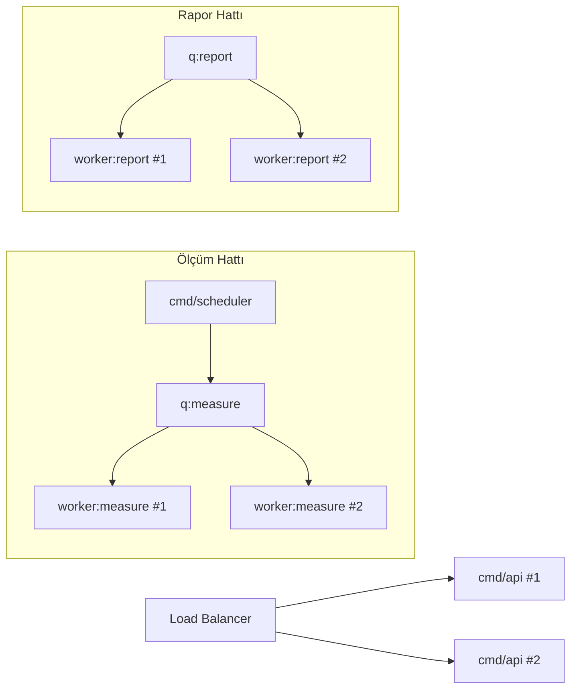

# 0509 · Ölçeklenebilirlik (Scalability)

| Alan | Değer |
|---|---|
| Doküman ID | 0509 |
| Proje | GeoLens Platform |
| Versiyon | 1.0 |
| Durum | Draft |
| Sahip | U2 AI Studio · Engineering |
| Tarih | 22 Temmuz 2026 |
| İlişkili | 0501, 0506, 0503, 0206 |

---

## 1. Amaç

Bu doküman GeoLens Platform'un ölçeklenebilirlik stratejisini tanımlar: yatay ölçekleme, darboğaz analizi ve kapasite planlaması.

---

## 2. Ölçekleme Stratejisi

| Bileşen | Strateji | MVP Ölçeği | HT1+ Ölçeği |
|---------|:--------:|:----------:|:-----------:|
| cmd/api | Yatay (load balancer) | 1-2 replika | 3-5 replika |
| cmd/worker | Yatay (her profil) | 1-2 replika/profil | 3-5 replika/profil |
| cmd/scheduler | Tek örnek (Redis kilidi) | 1 | 1 |
| PostgreSQL | Dikey → Salt okunur replika | 1 node | 1 primary + 1-2 replica |
| Redis | Dikey → Cluster | 1 node | 3 node Cluster |
| S3 | Doğal ölçeklenebilir | — | — |

---

## 3. Darboğaz Analizi

| Darboğaz | MVP Etkisi | Çözüm |
|----------|:----------:|-------|
| Motor API gecikmesi | Yüksek | Örnekleme planı, eşzamanlılık sınırı |
| PDF render | Orta | Ayrı worker profili, Chromium izolasyonu |
| RLS + kiracı sayısı | Düşük | İndeks optimizasyonu |
| Redis Streams | Düşük | Partitioning (HT1) |
| S3 erişimi | Düşük | CDN (Ufuk) |

---

## 4. Kapasite Hedefleri (V1)

| Metrik | Hedef |
|--------|:-----:|
| Maksimum kiracı | 100 |
| Günlük ölçüm | 1.000 |
| Maksimum prompt/kiracı | 20 |
| Tarihçe derinliği | Sınırsız (saklama politikasıyla) |
| API yanıt süresi (p50) | <1s |
| Pano yanıt süresi (p50) | <5s |
| PDF üretim süresi | <30s |

---

## 5. Worker Ölçekleme

---

## Kaynaklar

- 0501 System Architecture — konteyner yapısı
- 0506 Worker Design — profil, eşzamanlılık
- 0503 Event-Driven — kuyruk partitioning
- 0206 Roadmap — HT1/HT2 ölçekleme pencereleri
- 0304 Technology Selection — altyapı kararları

## Changelog

| Versiyon | Tarih | Değişiklik |
|----------|-------|------------|
| 1.0 | 22.07.2026 | İlk yayın: ölçekleme stratejisi, darboğaz analizi, kapasite hedefleri. |
