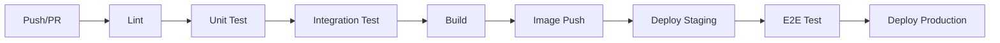

# 0901 · CI/CD

| Alan | Değer |
|---|---|---|
| Doküman ID | 0901 |
| Proje | GeoLens Platform |
| Versiyon | 1.2 |
| Durum | Approved |
| Sahip | U2 AI Studio · Engineering |
| Tarih | 22 Temmuz 2026 |
| İlişkili | 0510, 0900–0905, 0403, 0404, ADR-014 |

---

## 1. Amaç

Bu doküman GeoLens Platform CI/CD boru hattını tanımlar. GitHub Actions kullanılarak, lint → test → build → deploy aşamalarını otomatikleştirir.

---

## 2. Pipeline Aşamaları

---

## 3. CI Aşamaları (Her Push)

| Aşama | Araç | Süre | Kapı |
|:-----:|:----:|:----:|:----:|
| **Derleme** | mvn compile | 2 dk | D1-D7 bağımlılık kuralları |
| **Unit test** | mvn test | 3 dk | Tüm testler geçmeli (955 test) |
| **Build** | mvn package | 2 dk | Tek jar üretilmeli (api/worker/scheduler profilleri) |
| **Frontend lint** | ESLint | 1 dk | TS kalite kuralları |
| **Frontend build** | npm run build | 2 dk | Vite derleme |
| **Docker build** | docker build | 3 dk | java/Dockerfile multi-stage build |

---

## 4. CD Aşamaları (Staging)

| Aşama | Tetikleyici | Aksiyon |
|:-----:|:-----------:|---------|
| **Image push** | main branch push | Docker Hub'a push |
| **Deploy staging** | Image push sonrası | SSH + docker-compose pull/up |
| **Smoke test** | Deploy sonrası | Health check + API test |
| **E2E test** | Smoke geçerse | Playwright ile UI test |

---

## 5. Kalite Kuralları (Java/Maven)

| Kural | Açıklama |
|:-----:|----------|
| **Derleme** | mvn compile — paket sınırları (D1-D7) derleyici tarafından zorlanır |
| **Test** | mvn test — tüm testler geçmeli |
| **Güvenlik taraması** | Trivy (CI) — konteyner/bağımlılık taraması |

---

## 6. Ortam Değişkenleri Yönetimi

| Değişken | Kaynak | Açıklama |
|:--------:|:------:|----------|
| DB_URL | Kasa | PostgreSQL bağlantı |
| REDIS_URL | Kasa | Redis bağlantı |
| S3_ENDPOINT | Ortam | S3 uyumlu depo |
| S3_ACCESS_KEY | Kasa | S3 erişim anahtarı |
| S3_SECRET_KEY | Kasa | S3 gizli anahtarı |
| ENGINE_KEYS | Kasa | Motor API anahtarları |
| JWT_SECRET | Kasa | JWT imza anahtarı |

---

### Devralınan AVIP Kararları

| ID | Karar | Kaynak |
|----|-------|--------|
| **D-14** | **CI platformu:** GitHub Actions. TL 21.07.2026. | AVIP 0403 O-1 |
| **D-76** | **İzolasyon hızlı alt kümesi:** Kritik akışlar — her yüzey için 1-2 negatif senaryo. Tam paket main'de. TL 21.07.2026. | AVIP 0403 O-2 |
| **D-86** | **Staging yedek/geri dönüş:** DB dump (pg_dump) + imaj geri terfisi. TL 21.07.2026. | AVIP 0403 O-4 |
| **D-18** | **İmaj imzalama:** V1'de yok, hızlı takipte değerlendirilecek. TL 21.07.2026. | AVIP 0403 O-3 |
| **D-13** | **İş takip aracı:** GitHub Projects/Issues. TL 21.07.2026. | AVIP 0401 O-1 |

## Kaynaklar

- 0902 — Docker konteyner yapısı
- 0903 — Kubernetes dağıtımı
- 0403 CI/CD — AVIP CI/CD referansı
- 0404 Test Stratejisi — test kapsamı
- archive/avip-v1/README.md — AVIP arşiv indeksi

## Changelog

| Versiyon | Tarih | Değişiklik |
|----------|-------|------------|
| 1.0 | 22.07.2026 | İlk yayın: 7 aşamalı CI pipeline, staging CD, lint kuralları, env yönetimi. |
| 1.1 | 22.07.2026 | AVIP kapalı kararları taşındı: D-14 (GitHub Actions), D-76 (izolasyon test), D-86 (staging yedek), D-18 (imaj imzalama), D-13 (GitHub Projects). Devralınan Kararlar eklendi. |
| 1.2 | 15.08.2026 | **Java geçişi:** CI aşamaları ve kalite kuralları Maven araçlarına çevrildi (golangci-lint/go test/go build → mvn compile/test/package); Java 25 + temurin vurgulandı. ADR-014 ilişkili listesine eklendi. |
