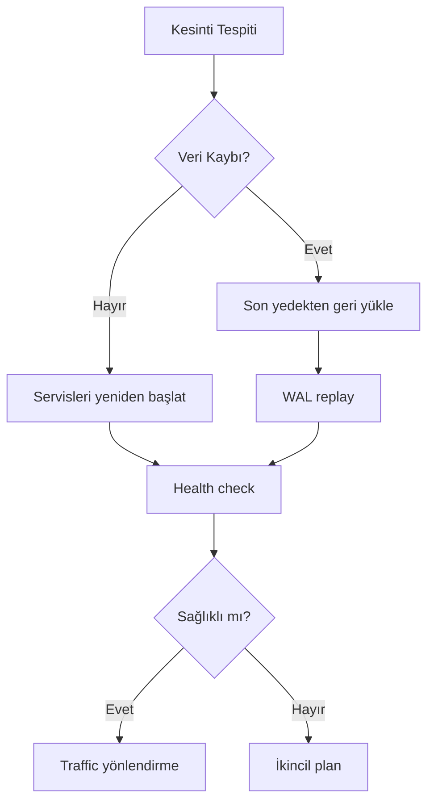

# Yedekleme ve Felaket Kurtarma (Backup & DR)

| Alan | Değer |
|---|---|
| Doküman ID | 09-devops/backup |
| Proje | GeoLens Platform |
| Versiyon | 1.0 |
| Durum | Draft |
| Sahip | U2 AI Studio · Engineering |
| Tarih | 22 Temmuz 2026 |
| İlişkili | 09-devops/*, 0605, 0507, 0204 |

---

## 1. Amaç

Bu doküman GeoLens Platform yedekleme ve felaket kurtarma (DR) stratejisini tanımlar. Veri kaybına karşı koruma ve kesinti sonrası hızlı toparlanma hedeflenir.

---

## 2. Yedekleme Stratejisi

| Veri | Yöntem | Sıklık | Saklama |
|:----:|:------:|:------:|:-------:|
| **PostgreSQL** | pg_dump (full) | Günlük | 30 gün |
| **PostgreSQL** | WAL arşivi | Sürekli | 7 gün |
| **Redis** | RDB snapshot | Saatlik | 24 saat |
| **S3 (özet)** | Çapraz bölge replikasyon | Anlık | Veri ömrü boyunca |
| **S3 (raw)** | Nesne kilidi + versiyonlama | Otomatik | Saklama politikasına göre |

---

## 3. Kurtarma Süresi Hedefleri (RTO/RPO)

| Veri | RTO | RPO |
|:----:|:---:|:---:|
| PostgreSQL | 4 saat | 1 saat |
| Redis | 1 saat | 1 saat |
| S3 | 15 dk | 0 (replikasyon) |
| Tüm sistem | 8 saat | 1 saat |

---

## 4. Felaket Kurtarma Prosedürü

---

## 5. Yedekleme Otomasyonu

| İş | Araç | Zamanlama |
|:--:|:----:|:---------:|
| PG yedek | pg_dump + cron | 03:00 UTC |
| WAL arşivi | pg_receivewal | Sürekli |
| Redis snapshot | SAVE komutu | Her saat başı |
| S3 çapraz bölge | S3 replication | Anlık |
| Yedek doğrulama | pg_restore test | Haftalık |

---

## 6. Kurtarma Testi

| Test | Sıklık | Kapsam |
|:----:|:------:|--------|
| PG geri yükleme | Haftalık | Son yedekten geri yükleme |
| Redis yeniden inşa | Aylık | Outbox'tan kuyruk yeniden oluşturma |
| Tam DR tatbikatı | Yıllık | Tüm sistemi sıfırdan ayağa kaldırma |

---

## Kaynaklar

- 0605 Data Retention — saklama süreleri
- 09-devops/monitoring — kesinti tespiti
- 0507 Multi-Tenancy — veri izolasyonu
- 0204 PRD — NFR-12 (veri koruma)
- archive/avip-v1/0311-observability-operations.md

## Changelog

| Versiyon | Tarih | Değişiklik |
|----------|-------|------------|
| 1.0 | 22.07.2026 | İlk yayın: yedekleme stratejisi, RTO/RPO hedefleri, DR prosedürü, otomasyon, test planı. |
