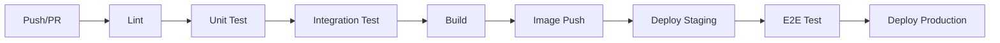

# CI/CD

| Alan | Değer |
|---|---|
| Doküman ID | 09-devops/ci-cd |
| Proje | GeoLens Platform |
| Versiyon | 1.0 |
| Durum | Draft |
| Sahip | U2 AI Studio · Engineering |
| Tarih | 22 Temmuz 2026 |
| İlişkili | 0510, 09-devops/*, 0403, 0404 |

---

## 1. Amaç

Bu doküman GeoLens Platform CI/CD boru hattını tanımlar. GitHub Actions kullanılarak, lint → test → build → deploy aşamalarını otomatikleştirir.

---

## 2. Pipeline Aşamaları

---

## 3. CI Aşamaları (Her Push)

| Aşama | Araç | Süre | Kapı |
|:-----:|:----:|:----:|:----:|
| **Lint** | golangci-lint | 2 dk | D1-D7 bağımlılık kuralları |
| **Unit test** | go test | 3 dk | Tüm testler geçmeli |
| **Build** | go build | 2 dk | Tüm cmd/* derlenmeli |
| **Integration** | testcontainers | 8 dk | PG/Redis/S3 ile testler |
| **Frontend lint** | ESLint | 1 dk | TS kalite kuralları |
| **Frontend build** | npm run build | 2 dk | Vite derleme |
| **Docker build** | docker build | 3 dk | Multi-stage build |

---

## 4. CD Aşamaları (Staging)

| Aşama | Tetikleyici | Aksiyon |
|:-----:|:-----------:|---------|
| **Image push** | main branch push | Docker Hub'a push |
| **Deploy staging** | Image push sonrası | SSH + docker-compose pull/up |
| **Smoke test** | Deploy sonrası | Health check + API test |
| **E2E test** | Smoke geçerse | Playwright ile UI test |

---

## 5. Lint Kuralları (golangci-lint)

| Kural | Açıklama |
|:-----:|----------|
| **depguard** | D1-D7 bağımlılık kuralları |
| **govet** | Standart Go vet |
| **staticcheck** | Kod kalitesi |
| **errcheck** | Hata kontrolü zorunlu |
| **ineffassign** | Kullanılmayan değişken |
| **gosec** | Güvenlik taraması |

---

## 6. Ortam Değişkenleri Yönetimi

| Değişken | Kaynak | Açıklama |
|:--------:|:------:|----------|
| DB_URL | Kasa | PostgreSQL bağlantı |
| REDIS_URL | Kasa | Redis bağlantı |
| S3_ENDPOINT | Ortam | S3 uyumlu depo |
| S3_ACCESS_KEY | Kasa | S3 erişim anahtarı |
| S3_SECRET_KEY | Kasa | S3 gizli anahtarı |
| ENGINE_KEYS | Kasa | Motor API anahtarları |
| JWT_SECRET | Kasa | JWT imza anahtarı |

---

## Kaynaklar

- 09-devops/docker — Docker konteyner yapısı
- 09-devops/kubernetes — Kubernetes dağıtımı
- 0403 CI/CD — AVIP CI/CD referansı
- 0404 Test Stratejisi — test kapsamı
- archive/avip-v1/0403-cicd-pipeline.md

## Changelog

| Versiyon | Tarih | Değişiklik |
|----------|-------|------------|
| 1.0 | 22.07.2026 | İlk yayın: 7 aşamalı CI pipeline, staging CD, lint kuralları, env yönetimi. |
