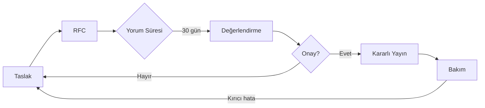

# 0003 · Yönetişim — GeoLens Specification

| Alan | Değer |
|---|---|
| Doküman ID | 0003 |
| Proje | GeoLens Specification |
| Versiyon | 1.0 |
| Durum | Review |
| Sahip | U2 AI Studio · Product |
| Tarih | 22 Temmuz 2026 |
| İlişkili | 0000, 0004, 01-standard/*, adr/* |

---

## 1. Amaç

Bu doküman GeoLens Specification'ın nasıl değiştirileceğini, kimlerin katkı yapabileceğini ve kararların nasıl alındığını tanımlar.

---

## 2. Değişiklik Tipleri

| Tip | Örnek | Geçiş Yolu |
|-----|-------|------------|
| **Düzeltme (Patch)** | Yazım hatası, açıklama iyileştirmesi | PR + 1 onay |
| **Genişletme (Minor)** | Yeni skor bileşeni, yeni kademe tanımı | RFC + 14 gün yorum + 2 onay |
| **Kırıcı (Major)** | Skor algoritması değişikliği, katman yeniden yapılanması | RFC + 30 gün yorum + Steward onayı |

---

## 3. Steward Modeli

| Rol | Sorumluluk |
|-----|------------|
| **Steward** | Standardın bütünlüğünden sorumlu. Kırıcı değişiklikleri onaylar. Başlangıçta GeoLens ekibi. |
| **Maintainer** | Günlük değişiklik yönetimi, PR inceleme, sürüm yayını. |
| **Katkıcı (Contributor)** | PR ile değişiklik önerebilir, yorum yapabilir. |
| **Kullanıcı (Adopter)** | Standardı uygulayan kurum. RFC dönemlerinde geri bildirim yapabilir. |

Gelecekte Steward yetkisi sektör konsorsiyumuna devredilebilir (ADR ile).

---

## 4. Yayın Süreci

---

## Changelog

| Versiyon | Tarih | Değişiklik |
|----------|-------|------------|
| 1.0 | 22.07.2026 | İlk yayın: değişiklik tipleri, Steward modeli, yayın süreci. |
