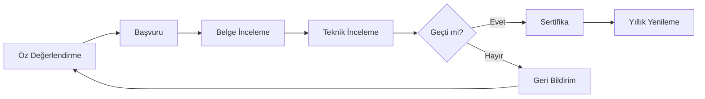

# 0302 · Sertifikasyon Süreci

| Alan | Değer |
|---|---|
| Doküman ID | 0302 |
| Proje | GeoLens Specification |
| Versiyon | 1.0.0 |
| Durum | Review |
| Sahip | U2 AI Studio · Product |
| Tarih | 22 Temmuz 2026 |
| İlişkili | 0301, 0303, 0304, 0109 |

---

## 1. Sertifikasyon Yolu

## 2. Sertifika Seviyeleri

| Seviye | Süre | Ücret | Denetim |
|:------:|:----:|:-----:|:-------:|
| Temel | Süresiz | Ücretsiz | Öz değerlendirme |
| İleri | 2 yıl | — | Öz değerlendirme |
| Tam | 1 yıl | — | Bağımsız denetim |
| Sertifikalı | 1 yıl | — | Bağımsız denetim + GeoLens onayı |

## 3. Sertifika Beyanı

Sertifikalı ürünler GeoLens web sitesinde listelenir ve "GAVF Sertifikalı" logosu kullanma hakkı kazanır.

---

## Changelog

| Versiyon | Tarih | Değişiklik |
|----------|-------|------------|
| 1.0.0 | 22.07.2026 | İlk yayın: sertifikasyon süreci. |
